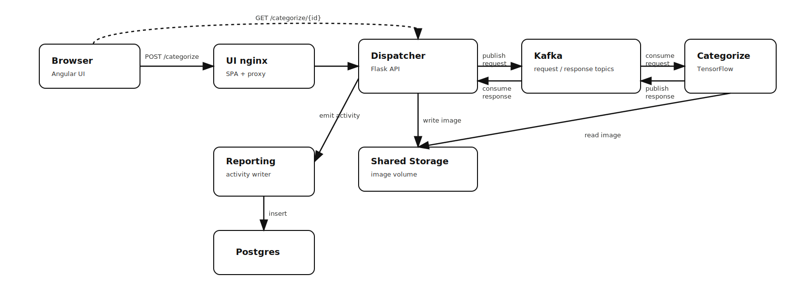

# Weather Guess Platform

Cloud-native microservice application that classifies uploaded images by weather conditions (e.g. sunny, foggy, rainy) using a deep learning model.

The platform demonstrates a production-oriented SDLC including containerisation, automated deployment, CI checks, and infrastructure automation.

---

## Overview

The system allows a user to:

1. Upload an image via the web UI  
2. Submit the image for classification  
3. Receive a predicted weather label  
4. Persist activity for reporting  

The architecture is fully containerised and designed for cloud deployment.

---

## Architecture

Components:

- UI — Angular application served by nginx  
- Dispatcher — Flask API handling uploads and orchestration  
- Categorize — TensorFlow inference service (VGG-19)  
- Reporting — Postgres writer service  
- Kafka + Zookeeper — async messaging backbone  
- Postgres — activity storage  

### High-level request and classification flow:


Key characteristics:

- asynchronous request pipeline  
- stateless services  
- container-first design  
- Ansible-driven host provisioning  
- AWS-compatible but cloud-agnostic  

---

## Repository Structure

Categorize  
: TensorFlow inference service

Common  
: shared storage, config and queue helpers

Dispatcher  
: Flask backend for upload and workflow

Reporting  
: user activity persistence

UI  
: Angular frontend

Docs  
: diagrams and supporting material

---

## Prerequisites

Local development:

- Docker  
- Docker Compose (plugin or standalone)  
- Node.js (only if rebuilding UI locally)  
- Python 3.10+  

Deployment automation:

- Ansible  
- AWS credentials (for EC2 provisioning)  

---

## Quick Start (Local)

From repository root:

```bash
docker compose up -d --build
```

Then open:

```
http://localhost:8088
```

Upload an image and verify a weather label is returned.

---

## Deployment (Automated)

Provision and deploy to a host:

```bash
ansible-playbook -i inventory.yml site.yml --limit <host>
```

The playbook will:

- configure the host  
- build container images  
- start the full stack  
- expose the UI  

---

## Configuration

Key environment variables:

STORAGE_DIR  
: image working directory (defaults to /tmp)

CONFIG_FILE  
: dispatcher configuration path

Kafka and Postgres settings are defined in docker-compose.yml and service configs.

---

## CI Pipeline

Current pipeline includes:

- Bandit security scan  
- npm audit  
- pytest execution  

The pipeline is intentionally lightweight but structured for extension.

---

## Known Limitations / Future Improvements

- Temporary storage currently uses `/tmp`  
- Model artefact stored in repository  
- Healthchecks not yet implemented  
- Frontend dependency vulnerabilities pending cleanup  
- HAProxy front layer optional for scale  

---

## Development Notes

When modifying the system:

- Preserve relative API paths in the Angular app  
- Ensure nginx proxy rules remain before SPA fallback  
- Kafka consumers must wait for partition assignment  
- Dispatcher and Categorize must share the same image volume  
- Build context for Docker images must remain project root  

Failure to maintain these invariants may break end-to-end flow.

---

## Roadmap

Near-term hardening:

- persistent shared storage  
- service healthchecks  
- external model download  
- improved Kafka readiness  

---

## License

Internal proof-of-concept project.

